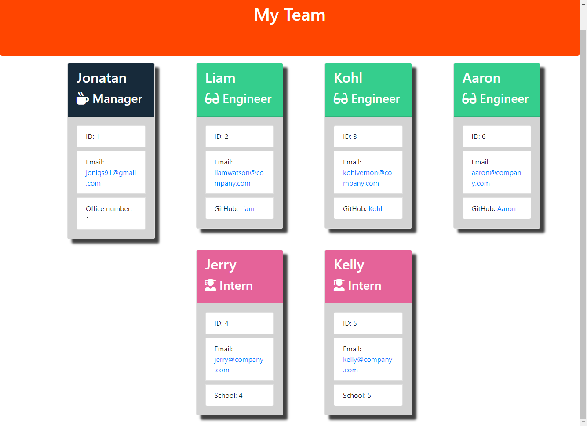

# Team generator

I created this project so I can generate a dashboard with a list of employees with easy to navigate menu.

## Demo

https://github.com/Joniqs/team-generator

## Installation

Make sure you have nodejs installed on your computer. After that clone this repository to your computer.

    git clone git@github.com:Joniqs/team-generator.git

Make sure you have node modules installed in the same folder before running this program:

    npm install

Once you have installed node modules in repository folder you can run this program with:

    node index.js

    
## Usage/Examples

Once you run a program you will be prompted to give details about your employees.
You can generate manager, engineer and interns. Once you don't want to add more employees choose option "Finish building the team" and then team.html file with your employee details will be generated in "Output" folder. Open your file and you will be presented with employees details.

## Credits

Jonatan Kwiatkowski, Liam Watson
# License

Please refer to the LICENSE in the repo.

